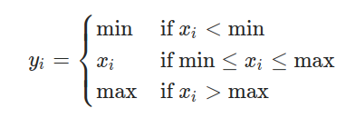
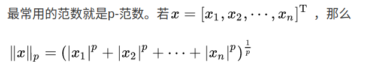
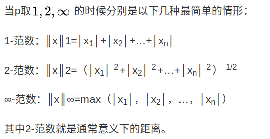
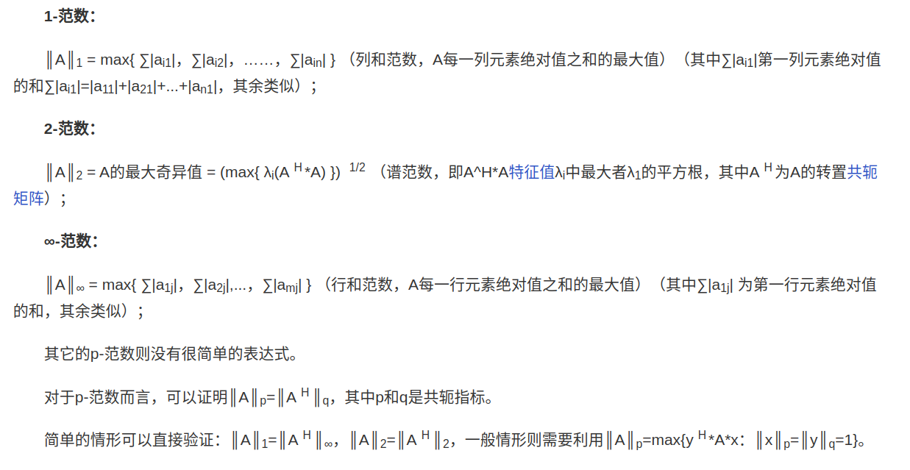
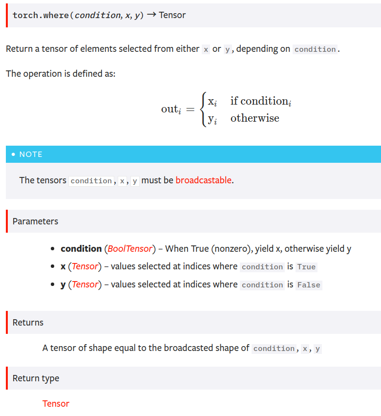
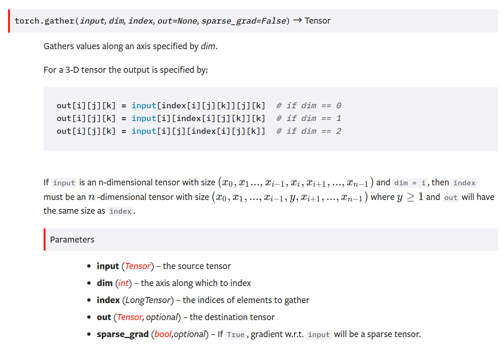

# clamp

# norm
范数(norm)是数学中的一种基本概念。在泛函分析中，它定义在赋范线性空间中，并满足一定的条件，即①非负性；②齐次性；③三角不等式。它常常被用来度量某个向量空间（或矩阵）中的每个向量的长度或大小。

三角不等式，即在三角形中两边之和大于第三边，有时亦指用不等号连接的含有三角函数的式子（这里不作介绍）。

## 空间范数

## 矩阵范数

# where

# gather
