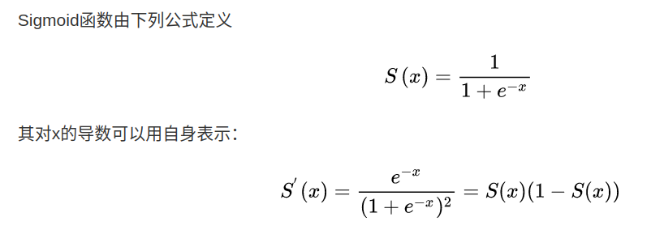

# 梯度
梯度：所有偏微分的向量
梯度的大小：变化趋势的速度
梯度的方向：变化趋势的方向

# 激活函数
激活：神经元的阈值
激活函数：负责将神经元的输入映射到输出端
## Sigmoid ==> 0 ~ 1

## Tanh ==> -1 ~ 1
 = 2 * sigmoid(2x) - 1

## ReLU

## Softmax ==> 0 ~ 1，并且所有输入加起来为1
用于分类问题很好

# Loss
## Mean Squared Error (MSE/均方误差)

## Cross Entropy Loss
一般搭配softmax激活函数使用

# 感知器——神经网络的组成单元

## 单层感知机

# 反向传播
我的理解：从结果方向开始求导，然后不断通过链式法则向最原始的方向传递，进而不断更新各个层的权值

