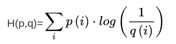

# Loss for classification

## MSE

## Cross Entropy Loss (交叉熵)

### Entropy

Uncertainty

measure of surprise

higher entropy = less info

系统的熵越高，系统越是混乱，系统越稳定

### Cross Entropy

交叉熵描述了两个概率分布之间的距离，当交叉熵越小说明二者之间越接近。

假设现在有一个样本集中两个概率分布p,q，其中p为真实分布，q为非真实分布。

#### 相对熵（kl散度） ==> 可以衡量p与q的相似性

相对熵趋向0 ==> p与q越相似

因此：

#### 二分类

H(P, Q) = -P(i1) * logQ(i1) - P(i2) * logQ(i2) = -(y * log(p) + (1 - y) * log(1 - p))

## Hinge Loss

# 激活函数

## sigmoid

## Tanh

## ReLU

## Leaky ReLU

## SELU

## softplus
