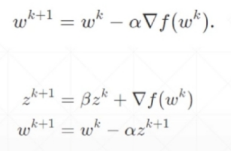

# cross validation

# regularization ==> weight decay

迫使目标函数之后加的范数趋向于零

## pytorch L1 regularization

## pytorch L2 regularization

# momentum

## pytorch momentum

只需要在网络参数中加上momentun=一个数，即可

# learning rate decay

## scheme 1: torch.optim.lr_scheduler.ReduceLROnPlateau

[torch.optim.lr_scheduler.ReduceLROnPlateau类](https://blog.csdn.net/weixin_40100431/article/details/84311430)

## scheme 2: torch.optim.lr_scheduler.StepLR

# early stopping

1. validation set to select parameters
2. monitor validation performance
3. stop at the highest val performance

# dropout

迫使w参数的数量少一点，好一点

learning less to learn better

在网络里面直接用torch.nn.Dropout()

train 的时候，可以dropout ==> net.train()

在 test 的时候，要把dropout去掉 ==> net.eval()

# stochastic gradient descent

不把所有数据进行计算，只取一部分

## stochastic ==> x 生成的 f(x) 符合一定分布

在一定分布上有一定随机性，不是random

## deterministic ==> x 和生成的 f(x) 一一对应
