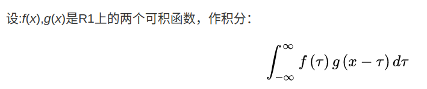
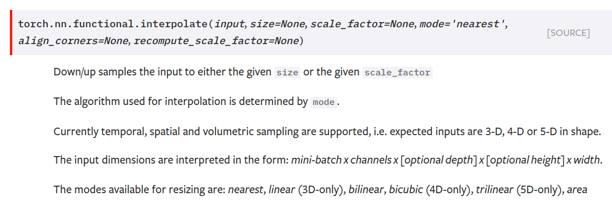
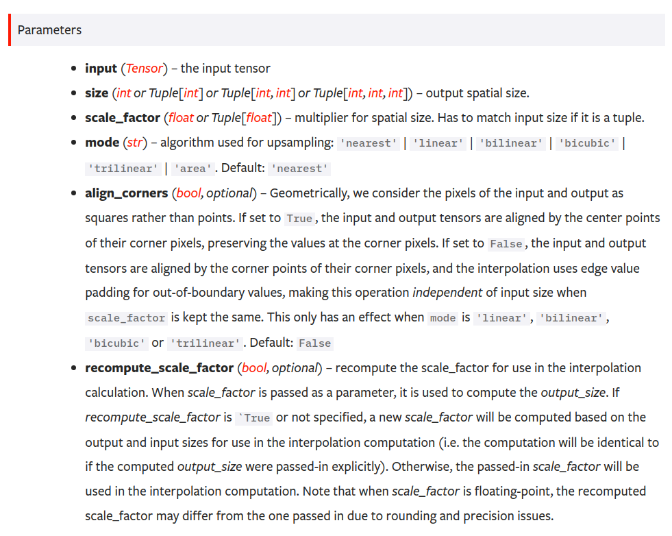

# 巻积

定义：在泛函分析中，卷积、旋积或摺积(英语：Convolution)是通过两个函数f 和g 生成第三个函数的一种数学算子，表征函数f 与g经过翻转和平移的重叠部分函数值乘积对重叠长度的积分。

可以证明，关于几乎所有的实数x，上述积分是存在的。这样，随着x的不同取值，这个积分就定义了一个新函数h(x)，称为函数f与g的卷积，记为h(x)=(f*g)(x)。

容易验证，(f * g)(x) = (g * f)(x)，并且(f * g)(x)仍为可积函数。这就是说，把卷积代替乘法，L1（R1）空间是一个代数，甚至是巴拿赫代数。

卷积与傅里叶变换有着密切的关系。利用一点性质，即两函数的傅里叶变换的乘积等于它们卷积后的傅里叶变换，能使傅里叶分析中许多问题的处理得到简化。

# 巻积神经网络

[卷积神经网络之卷积计算、作用与思想](https://www.cnblogs.com/shine-lee/p/9932226.html)

# 池化层与采样

## downsample 下采样

## max pooling

## average pooling

## upsample 上采样

# batch normalize

1. converge faster
2. better performance
3. robust
4. stable
5. larger learning rate
